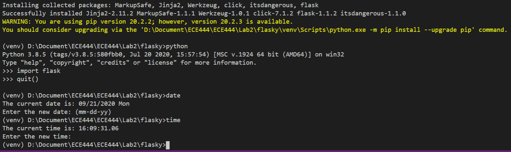
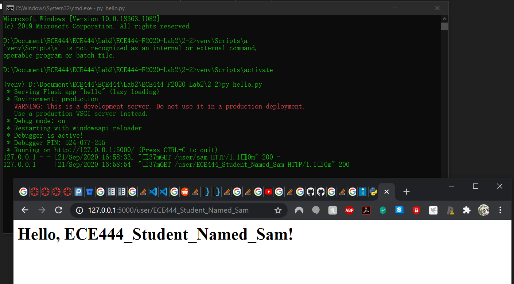

# ECE444-F2020-Lab2
ECE444-F2020-Lab2\
this repo is a clone of
https://github.com/miguelgrinberg/flasky

# Activity 1
\

# Activity 2
\

# Activity 3

From my understanding, the Flask Context Globals are variables that stores relevant information of the current application session. \
They can be accessed when the application is active, or when the request context is available.\
They provide information that are specific to the current executing application to the developer.
